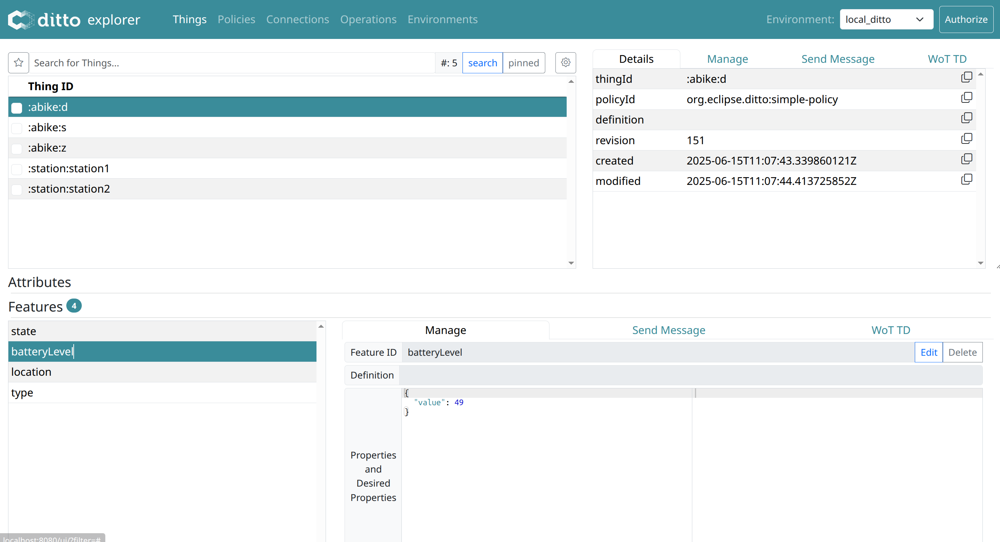

== Autonomous A-Bike Case Study

=== New Features

The following new features have been introduced in the extension of the EBike case study, featuring the autonomous e-bike ("a-bike") for smart city environments:

- The a-bike can autonomously reach the nearest station after being used.
- The a-bike can autonomously reach a user who requests the service.

Also, it was needed that the a-bike and the elements of the smart city (e.g., stations) would be available as Digital Twins.

=== Requirements

We report here only the Domain-Driven-Design parts that are new or changed compared to the original EBike case study.

1. The system must allow users to request an autonomous a-bike to reach their location.
2. The system must allow users to view the real-time position and status of a-bikes.
3. The system must allow a-bikes to autonomously return to the nearest station after use.
4. The system must allow operators to monitor all a-bikes and stations in real time via Digital Twin.
5. The system must allow operators to view the operational status and real-time position of a-bikes on a map.

==== User Stories

[cols="1,2,2", options="header"]
|===
| As a... | I want to... | So that...

| User
| Request an a-bike to come to my location
| I can conveniently access a bike without searching for one

| City Operator
| Have the a-bike autonomously return to the nearest station after use
| I can ensure bikes are available for other users and reduce operational costs

| City Operator
| Track the real-time location and status of each a-bike via digital twin
| I can ensure efficient operation and maintenance of the bike fleet
|===

==== Use Cases

[plantuml, {diagramsdir}/abike-usecases, svg, title="ABike Application Use Cases", width=50%]
----
!include resources/puml/abike-usecases.puml
----

==== Use Case Descriptions

**Request a-bike to user location**

[cols="2,3", options="header"]
|===
| Field           | Description

| Actors          | User, A-Bike, System
| Scope           | A-Bike System
| Preconditions   | The user must be authenticated and have credits available.
| Postconditions  | An autonomous a-bike is sent to the user's location.
| Trigger         | The user requests an a-bike via the application.
| Flow   | 1. The user selects the option to request an a-bike. +
2. The system sends the command to the a-bike to reach the user's location. +
3. The user can see the approaching a-bike's arriving on the map. +
|===

**A-bike returns autonomously to nearest station**

[cols="2,3", options="header"]
|===
| Field           | Description

| Actors          | A-Bike, System, City Operator
| Scope           | A-Bike System
| Preconditions   | The ride has ended and the a-bike is not at a station.
| Postconditions  | The a-bike autonomously reaches the nearest station and becomes available.
| Trigger         | The system detects that the ride ended outside a station.
| Flow   | 1. The system identifies the nearest station to the current a-bike position. +
2. The system sends the command to the a-bike to reach the station. +
3. The a-bike autonomously moves towards the station. +
4. The system updates the a-bike's position in real time. +
5. Upon arrival at the station, the a-bike is marked as available.
|===

**Monitor a-bike and stations via Digital Twin**

[cols="2,3", options="header"]
|===
| Field           | Description

| Actors          | City Operator
| Scope           | A-Bike System
| Preconditions   | The operator must be authenticated.
| Postconditions  | The operator views the real-time status and position of all a-bikes and stations.
| Trigger         | The operator accesses the Digital Twin dashboard.
| Flow   | 1. The operator accesses the Digital Twin dashboard. +
2. The system displays the dashboard with all a-bikes and stations, updated in real time. +
3. The operator can select an a-bike or station to view details and operational status. +
|===

==== Bounded Contexts
In addition to the original EBike case study, a new bounded context is introduced for the autonomous a-bike:

- Autonomous A-Bike Context: This context handles the management of A-Bikes and Stations.

Initially, it was considered to extend the original EBike context to include the autonomous a-bike. However, it was decided to create a new bounded context to better encapsulate the new features and requirements. This separation is also expected to be beneficial for the future development of a more complex smart city system.

Stations are also included in this new context, as they are essential and closely related to the operations of the autonomous a-bikes.

=== Implementation
Only non-trivial implementation details are reported here.

==== New Microservices
It was decided to create a new microservice for the autonomous a-bike, that manages the autonomous a-bike and the stations. The new microservice is called `abike-microservice`.

It follows the same architecture of the other microservices, using hexagonal architecture and an Event-Driven approach.

==== New Communication Flow and Topics

Here we describe the new topics and communication flows introduced in the autonomous a-bike case study.
It was decided to duplicate some topics, even though it would have been possible to use the same topics as those used for E-Bikes. However, having separate topics for the autonomous a-bike was considered more appropriate to avoid confusion and to better support future extensions of the smart city system.

[plantuml, {diagramsdir}/kafka-comm-abike, svg, title="Microservices communications of ABike System using Kafka", width=50%]
----
!include resources/puml/kafka-comm-abike.puml
----

===== Detailed Communication Patterns

===== 1. ABike State Update
- **Producer:** abike-microservice (_BikeCommunicationAdapter_)
- **Topic:** abike-updates
- **Consumers:** map-microservice (_BikeUpdateAdapter_), ride-microservice (_BikeConsumerAdapter_)
- **Flow:** When an ABike's state or position changes, the abike-microservice publishes this update to the abike-updates topic. The map service consumes this message to update the bike's position on the map via websocket, while the ride service updates its local repository of available ABikes.

===== 2. Station State Update
- **Producer:** abike-microservice (_StationCommunicationAdapter_)
- **Topic:** station-updates
- **Consumers:** map-microservice (_StationUpdateAdapter_), ride-microservice (_StationConsumerAdapter_)
- **Flow:** When a station's data changes, the abike-microservice publishes an update to the station-updates topic. The map service consumes this to update the station's view via websocket, and the ride service consumes it to keep its local station repository synchronized.

===== 3. Ride Events Affecting ABike
- **Producer:** ride-microservice (_BikeCommunicationAdapter_)
- **Topic:** abike-ride-update
- **Consumer:** abike-microservice (_RideCommunicationAdapter_)
- **Flow:** When the ride-microservice processes a ride event involving an ABike (e.g., start/end ride), it publishes an update to the abike-ride-update topic. The abike-microservice consumes this message to update the ABike's state accordingly (e.g., from AVAILABLE to IN_USE).

===== 4. Bike Dispatch Notifications
- **Producer:** ride-microservice (_UserCommunicationAdapter_)
- **Topic:** ride-bike-dispatch
- **Consumer:** user-microservice (_RideConsumerAdapter_)
- **Flow:** When the ride-microservice processes a dispatch request (e.g., sending an autonomous bike to a user), it publishes a message to the ride-bike-dispatch topic. The user-microservice consumes this message and forwards it to the specific user's client via a real-time websocket.

=== Digital Twin

For the Digital Twin, it was decided to use Eclipse Ditto, which is a powerful platform for managing Digital Twins. 

The platform is setupped to listen to the Kafka topics related to the a-bike and stations, and it automatically updates the Digital Twin representation of the a-bike and stations in real time, using a JavaScript payload mapper.

==== Connection Setup and Docker Integration

The digital twin implementation uses Eclipse Ditto connected to the Kafka message broker to synchronize real-time data from the microservices. The connection is established through Ditto's connectivity service, which is deployed via Docker and shares the same network (`kafka-ditto-net`) as the Kafka broker to enable communication.

The Kafka broker is configured to be accessible from both the microservices network and the Ditto network:

[source,yaml]
----
kafka-broker:
  networks:
    - eureka-network
    - kafka-ditto-net
----

==== Kafka Topics Consumption

The Ditto connection listens to two main Kafka topics that provide real-time updates about the autonomous bike-sharing system:

- **`abike-update`**: Receives updates about individual autonomous a-bikes
- **`station-update`**: Receives updates about stations

The connection configuration specifies these topics as source addresses:

[source,json]
----
"sources": [
  {
    "addresses": [
      "abike-update",
      "station-update"
    ],
    "consumerCount": 1,
    "payloadMapping": ["JavaScript"]
  }
]
----

==== Data Transformation with JavaScript Mapper

The connection uses a JavaScript mapper to transform incoming Kafka messages into Ditto protocol messages. The mapper handles both bike and station updates by creating appropriate thing IDs and feature structures:

[source,javascript]
----
function mapToDittoProtocolMsg(headers, textPayload, bytePayload, contentType) {
    var topic = headers["kafka.topic"] || "";
    let thingId;
    if (topic === "abike-update") {
        thingId = "abike:" + jsonData.id;
    } else if( topic === "station-update") {
        thingId = "station:" + jsonData.id;
    }
    
    // Transform properties into Ditto features
    var features = {};
    for (var key in jsonData) {
        if (jsonData.hasOwnProperty(key) && key !== 'id') {
            features[key] = {
                properties: {
                    value: jsonData[key]
                }
            };
        }
    }
    // Create Ditto protocol message...
}
----

This mapper creates digital twin representations where each bike becomes a "thing" with the ID format `abike:{bikeId}` and each station becomes `station:{stationId}`. All properties from the Kafka message (except the ID) are transformed into Ditto features with nested property structures.

The real-time synchronization ensures that the digital twin always reflects the current state of the physical bike-sharing system, enabling operators to monitor fleet status, track bike locations, and manage station capacity through the digital twin interface.

.Ditto Explorer with Things
